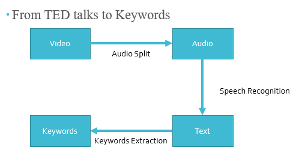
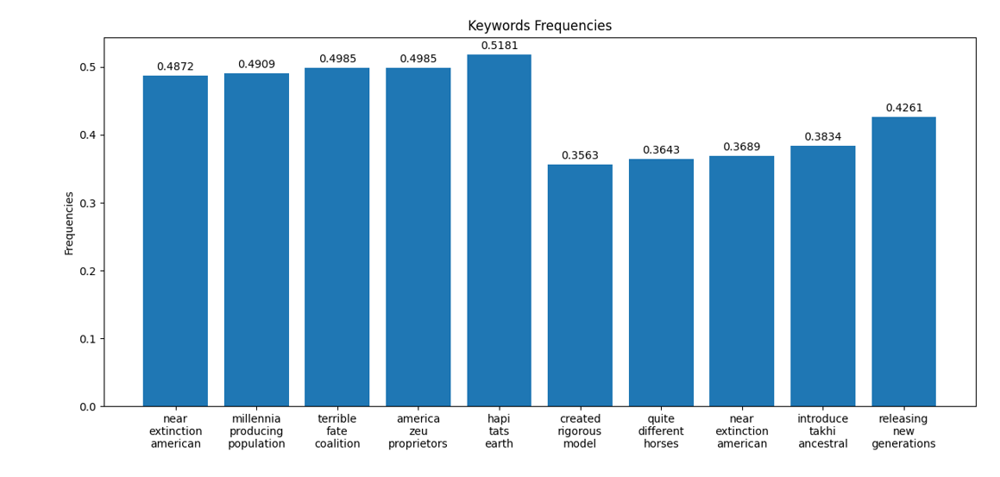

## Video-Content-Keyword-Extraction-and-Visualization

A BERT project aims to extract keywords from videos and generate data visualization for the results.



---

### Table of Contents

- [Description](#description)
- [How To Use](#how-to-use)
- [License](#license)

---

## Description

In our project, we developed a three-step framework to extract keywords from TED talk videos for better content understanding. Our primary focus was on the video titled "Can zoos actually save species from extinction?", which lasted 4 minutes and 35 seconds.

The first step involved extracting audio from the video using the movies tool. The extracted audio file was then processed through Wav2Vec2, a speech recognition software, to convert it into text format. It is noteworthy that the resulting text contained all upper-case words without punctuation, making sentence demarcation and subsequent text analysis challenging.

Despite the inherent complexities, our speech recognition process achieved a relatively modest error rate of 10.1%. A few examples of misrecognized words include "TAKHI" as "TAKI", "1960S" as "NINETEEN SIXTIES", "LIVESTOCK" as "LIVE STOCK", "ZOOS" as "ZEUS", and "ANIMALS" as "ENEMOS".

In the final step, we utilized spacy and KeyBERT for keyword extraction. Notably, our extracted keywords, which included phrases like 'near extinction American', 'millennia producing population', 'visitors exotic enemies, 'native taki horses', and 'rol Zeus conservation', did not contain the word "ZOOS". This omission could potentially lead to misunderstandings, considering the topic of the video.

Overall, our project effectively demonstrated the utility of keyword extraction from videos for swift and easy comprehension of video content. However, potential misrecognition during the audio-to-text conversion stage highlighted the importance of meticulous quality checks in such processes.

#### Technologies

  - Python
  - BERT model

[Back To The Top](#read-me-template)

---

## How To Use

#### Installation
Install all the required packages below and download the video from TED as subject:
https://www.ted.com/talks/nigel_rothfels_can_zoos_actually_save_species_from_extinction

```html
import torch
import spacy
import librosa
from moviepy.editor import AudioFileClip
from transformers import Wav2Vec2ForCTC, Wav2Vec2Tokenizer
#from transformers import Wav2Vec2ForCTC, Wav2Vec2CTCTokenizer
from keybert import KeyBERT
from wordcloud import WordCloud
import matplotlib.pyplot as plt
import numpy as np
```

[Back To The Top](#read-me-template)

---

## License

MIT License

---

## Result in this case

